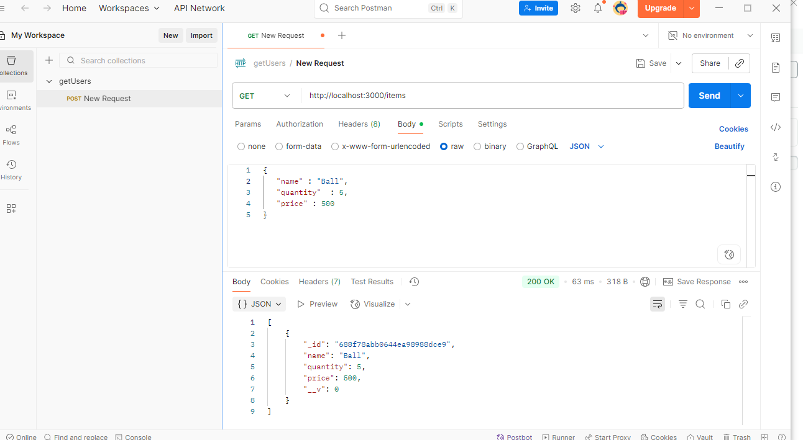
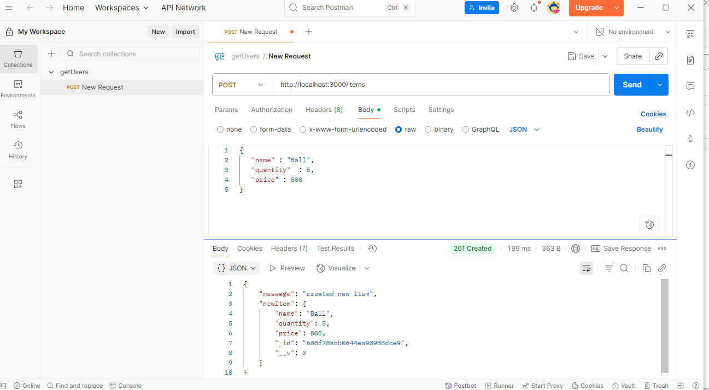
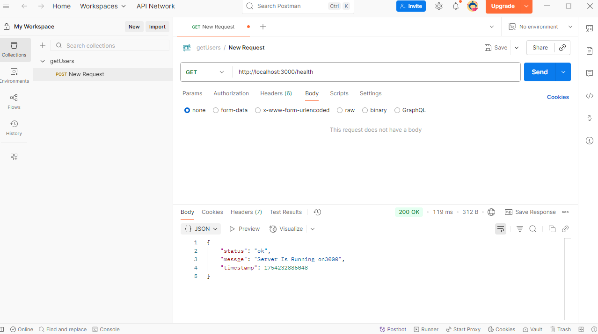

# 🧾 Inventory Management System (Backend)

A simple backend project using **ExpressJS** and **MongoDB** for managing inventory items.

## 📦 Features

- ExpressJS server running on port 3000
- MongoDB connection using Mongoose
- REST API to add and view items
- Middleware for logging and 404 error handling
- Tested using Postman

---

## 🚀 How to Run

### 1. Clone the Repository

```bash
git clone https://github.com/your-username/inventory-backend.git
cd inventory-backend
```

### 2. Install Dependencies

```bash
npm install
```

### 3. Set up MongoDB

- Use **MongoDB Atlas** or **Compass**
- Create a `.env` file or directly paste the connection string in your `db.js`

Example MongoDB URL:

```
mongodb+srv://<username>:<password>@cluster0.mongodb.net/inventory
```

## 🔄 API Endpoints

### ➕ Create Item

- **POST** `/items`
- Body (JSON):
```json
{
  "name": "Laptop",
  "quantity": 10,
  "price": 599.99
}
```

### 📃 Get All Items

- **GET** `/items`

### ⚙️ Health Check

- **GET** `/health` → returns `"Server is healthy"`

### 🏠 Root

- **GET** `/` → returns `"Inventory API is Running"`

---

## 🧪 Postman

API tested using Postman. Screenshots of API requests and responses:






---

## 📁 Project Structure

```
.
├── controllers/
│   ├── baseController.js
│   ├── healthController.js
│   └── invController.js
├── media/
├── middlewares/
│   ├── HandleError.js
│   ├── log.js
│   └── validate.js
├── models/
│   └── invModal.js
├── routes/
│   ├── baseRoute.js
│   ├── healthRoute.js
│   └── invRoute.js
├── .env
├── db.js
├── package.json
├── package-lock.json
└── README.md
```

---

## 🧑‍💻 Author

- Developed by Mohammed Safwan
